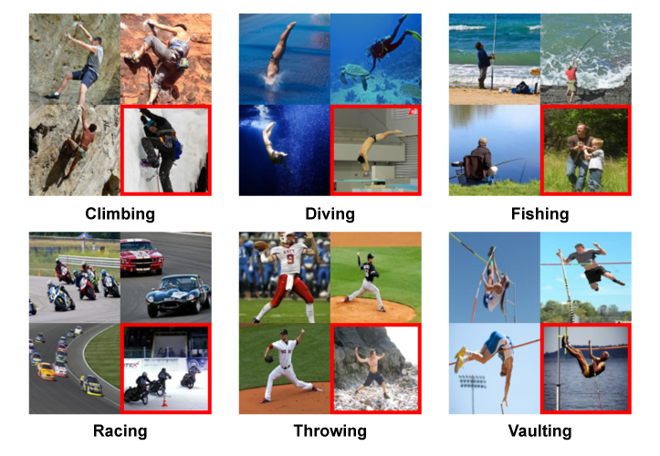

# Biased Action Recognition Dataset
The repository for the official Biased Action Recognition (BAR) dataset for the paper [Learning from Failure: Training Debiased Classifier from Biased Classifier](https://arxiv.org/pdf/2007.02561.pdf) (NeurIPS 2020) by Junhyun Nam et al. 


  

Biased Action Recognition (BAR) dataset is a real-world image dataset categorized as six action classes which are biased to distinct places. We carefully settle these six action classes by inspecting [imSitu](http://imsitu.org/), which provides still action images from Google Image Search with action and place labels. In detail, we choose action classes where images for each of these candidate actions share common place characteristics. At the same time, the place characteristics of action class candidates should be distinct in order to classify the action only from place attributes. In the end, we settle the six typical action-place pairs as (*Climbing*, *RockWall*), (*Diving*, *Underwater*), (*Fishing*, *WaterSurface*), (*Racing*, *APavedTrack*), (*Throwing*, *PlayingField*),and (*Vaulting*, *Sky*).

## The source of dataset
We construct BAR with images from various sources: [imSitu](http://imsitu.org/), [Stanford 40 Actions](http://vision.stanford.edu/Datasets/40actions.html), and Google Image Search. In the case of imSitu, we merge several action classes where the images have a similar gesture for constructing a single action class of BAR dataset, e.g., {hurling, pitching, flinging} for constructing throwing, and {carting, skidding} for constructing racing.

## Dataset stats


| Action     | Climbing | Diving | Fishing | Racing | Throwing | Vaulting | Total |
|------------|----------|--------|---------|--------|----------|----------|-------|
| Training   | 326      | 520    | 163     | 336    | 317      | 279      | 1941  |
| Evaluation | 105      | 159    | 42      | 132    | 85       | 131      | 654   |


## The dataset directory tree and Metadata
We provide BAR dataset into train/test folders. Each folder has 1941 and 654 6-class action images respectively. 
```
train/
|---- climbing_X.png
|---- ...
test/
|---- climbing_X.png
|---- ...
```

We also provide metadata of BAR dataset. Metadata is provided in the json format with `filename` as a key and corresponding information (`class`, `image host`, `source of image`, and etc.) as values.
```
{
  "climbing_0": {
        "cls": "climbing",
        "image_description": "Man Climbing on Rock Mountain \u00b7 Free Stock Photo",
        "image_filename": "28.pexels-photo-449609.jpeg",
        "image_format": "jpg&fm=jpg",
        "image_height": 6000,
        "image_host": "pexels.com",
        "image_link": "https://images.pexels.com/photos/449609/pexels-photo-449609.jpeg?cs=srgb&dl=action-adventure-challenge-climb-449609.jpg&fm=jpg",
        "image_source": "https://www.pexels.com/photo/action-adventure-challenge-climb-449609/",
        "image_thumbnail_url": "https://encrypted-tbn0.gstatic.com/images?q=tbn%3AANd9GcSFSREyaj-JvFh6DHmiQUIpklAKTD9DmXu-8xcQL---ImbyxMM6&usqp=CAU",
        "image_width": 4000,
        "source": "google",
        "train": true
  },
  ...
}
```
Since BAR dataset is sourced from multiple datasets, our metadata also provides the original file name of source datasets (see below example).
```
{
  ...,
  "climbing_107": {
        "cls": "climbing",
        "detail": {
            "file_name": "climbing_35.jpg"
        },
        "source": "imSitu",
        "train": true
  },
  ...
}
```
All images from searched from Google or Flickr, we disclose the license (CC), queries, and host information like below.
```
{
  ...,
  "climbing_13": {
        "cls": "climbing",
        "detail": {
            "CC": "CC BY 2.0",
            "id": "9713508338",
            "license": "4",
            "owner": "76471686@N05",
            "query": "ice+wall+climbing",
            "src": "https://farm4.staticflickr.com/3805/9713508338_b4d93f76e8.jpg"
        },
        "source": "flickr",
        "train": true
  },
  ...
}
```

## Citation
If you find this useful in your research, please consider citing:
```
@misc{nam2020learning,
      title={Learning from Failure: Training Debiased Classifier from Biased Classifier}, 
      author={Junhyun Nam and Hyuntak Cha and Sungsoo Ahn and Jaeho Lee and Jinwoo Shin},
      year={2020},
      eprint={2007.02561},
      archivePrefix={arXiv},
      primaryClass={cs.LG}
}
```
